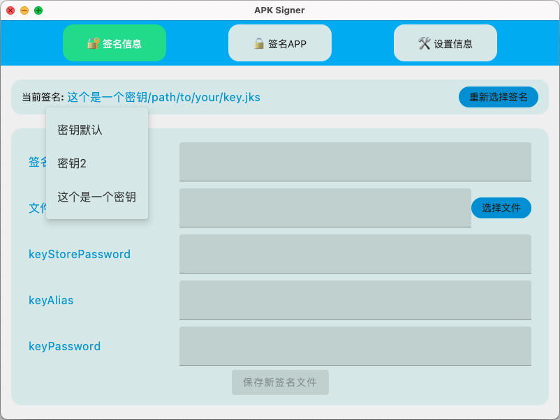
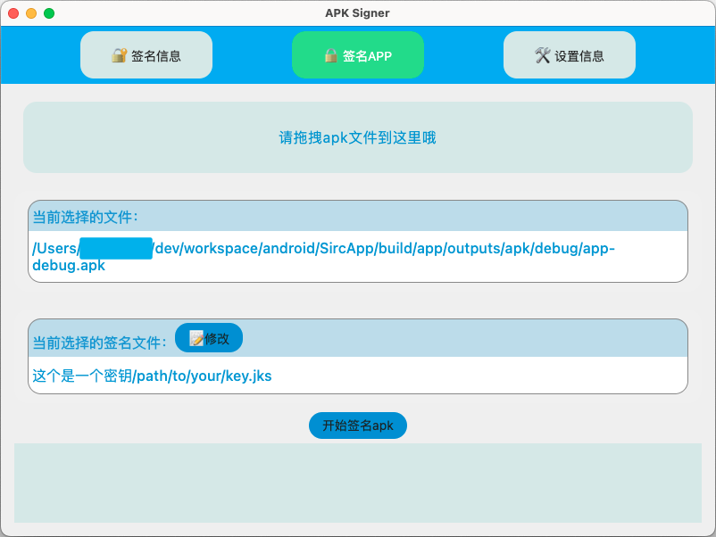
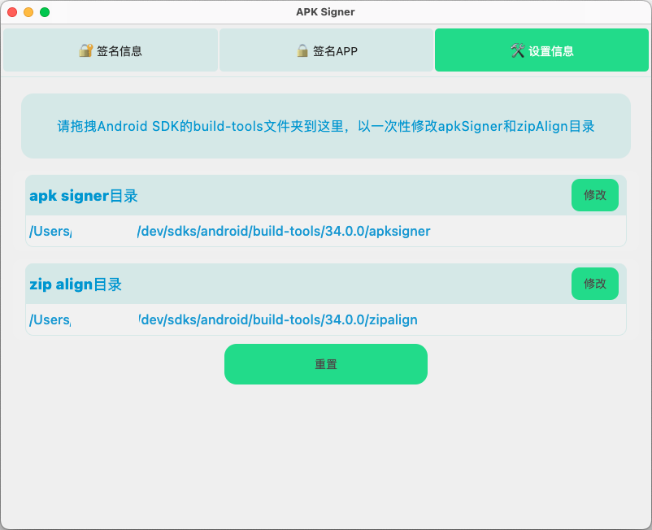

<div align="center">


# ApkSigner

  

A tool for Android developers to sign their applications with GUI software.

一款供 Android 开发者用来可视化签名的工具。

基于 [JetBrains Compose Multiplatform](https://github.com/JetBrains/compose-multiplatform/)


[](https://github.com/jixiaoyong/ApkSigner/releases)

</div>

<br/>
<br/>
<br/>

工作中打包的某些 APK 在 360 加固时提示“没有签名”，但 360 加固提供的签名过程又过于繁琐，故此开发这样一个小工具，使用图形界面来签名
APK 文件。

本软件基于 JetBrains Compose Multiplatform 开发，支持 macOS、Windows、Linux。

我日常开发主要基于 macOS，因此在 Windows 和 Linux 上可能存在一些尚未发现的兼容性问题。如果你发现了这样的问题，敬请[告知](https://github.com/jixiaoyong/ApkSigner/issues)，我会尽可能适配。同时也非常欢迎你提交[PR](https://github.com/jixiaoyong/ApkSigner/pulls)。

## 主要功能

本 APP 是为了方便你通过图形界面操作签名 APK，支持管理、切换多个签名，一键签名 APK 等。
工具并不提供生成签名文件的功能，要使用此工具，你还需要提前准备好如下内容：

- **签名文件**，一般为 .keystore 或者 .jks 格式的文件，用来签名 APK
- **apksigner** 和 **zipalign** 文件，用来签名、对齐 APK，一般在 Android SDK 中的 `build-tools` 文件夹下某个版本中
- **Java 开发环境**，签名 APK 的 apksigner 需要读取 `JAVA_HOME` 配置

🚧 目前界面功能还在持续完善中，基础功能可用：

- [x] 增/删/切换签名信息（只会修改 APP 自身配置，不会修改您的文件）
- [x] 签名 APK 文件，支持 V1，V2，V3，V4 方案
- [x] 指定签名 APK 输出目录
- [x] 查看 APK 已有签名信息
- [x] 支持 Light 和 Dark 主题，并可自动切换
- [x] 可选对齐与否
- [x] 支持多文件签名，查看签名
- [ ] 导入多个签名文件
- [x] 自动保存/匹配 APK 对应的签名信息
- [ ] 优化签名配置
- [x] 美化主题
- [ ] 添加查看日志功能
- [x] 支持国际化语言，可自动识别系统语言

出于隐私考虑，本 APP 不会添加联网检测更新功能，如果你希望获取最新版本的信息，可以在 [GitHub](https://github.com/jixiaoyong/ApkSigner) 上面 star 或者 watch 本项目，这样当 APP 有更新时 GitHub 会在首页或者使用邮件通知你。

## 界面预览

<br/>





## 使用

以下方式选择你喜欢的即可

### 1. 运行 .dmg 或 .msi 等系统特定软件包【推荐👍】

- 直接运行本仓库提供的对应软件包

点击下载[📦 最新 Release 软件包 (.dmg/.msi/.deb)](https://github.com/jixiaoyong/ApkSigner/releases)

- 或下载源码自助打包：

```groovy
packageReleaseDeb // 适用于 ubuntu 等 Linux 系统
packageReleaseDmg // 适用于 macOS 系统
packageReleaseMsi // 适用于 Windows 系统
packageReleaseDistributionForCurrentOS
```

### 2. 编译源码

- 下载源码后，使用 IDEA 打开并运行 Main.kt 文件即可启动图形化界面。

### 3. 运行 jar 包

1. 自行使用 jar 打包命令`./gradlew packageReleaseUberJarForCurrentOS`打包

2. 运行`java -jar xxx.jar`即可启动软件

针对 MAC 用户，可以考虑使用 [jar2app](https://github.com/dante-biase/jar2app)
将 jar 打包为 app 使用，避免繁琐的 mac 系统签名过程。

## License

Copyright (C) JI,XIAOYONG

本软件（[ApkSigner](https://github.com/jixiaoyong/ApkSigner)）是自由软件：你可以再分发之和/或依照由自由软件基金会发布的 GNU
通用公共许可证修改之，无论是[版本 3 许可证](./LICENSE)，还是（按你的决定）任何以后版都可以。

发布 [ApkSigner](https://github.com/jixiaoyong/ApkSigner) 是希望它能有用，但是并无保障;甚至连可销售和符合某个特定的目的都不保证。请参看
GNU 通用公共许可证，了解详情。

你应该随程序获得一份 GNU 通用公共许可证的复本。如果没有，请看 <https://www.gnu.org/licenses/>。

### 附加条款

在不违反上述条款的基础之上，如果你想要基于此项目制作、分发你自己的软件版本，还需要遵守如下条款：

- **保留作者信息**：使用、复制、修改或分发本项目的源代码时，必须保留原作者的姓名和联系信息。

- **Logo 使用限制**：未经原作者明确书面许可，不得使用、复制、修改或分发本项目的 Logo。

- **源码链接**：在使用、复制、修改或分发本项目的源代码、软件作品时，必须在显著位置（例如本软件“设置信息”页面底部）提供指向原项目源码网址的链接。 

  文本内容为“本项目基于 JI,XIAOYONG 的开源项目 ApkSigner 开发，你可以免费在 <https://github.com/jixiaoyong/ApkSigner> 获取项目源代码”。
